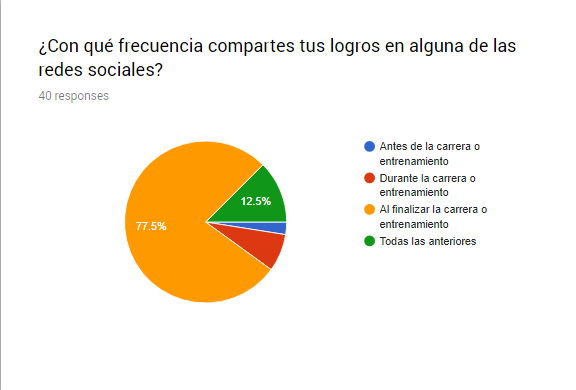
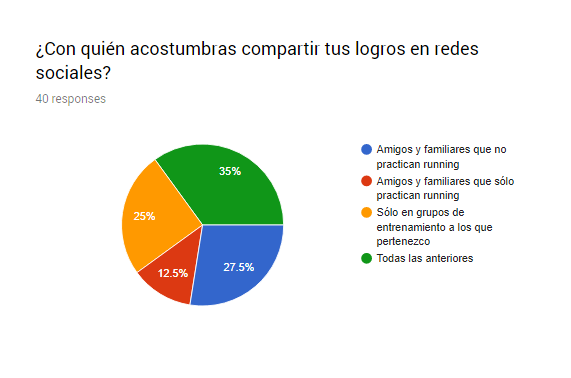
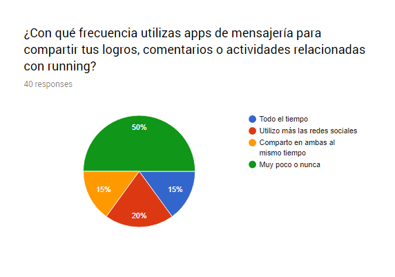
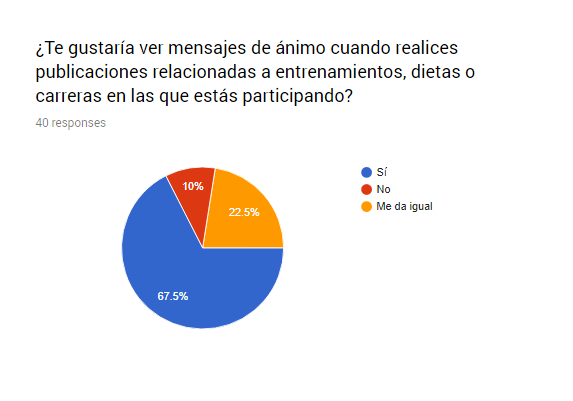

https://biokah.github.io/social-network/

### SOBRE EL PRODUCTO
El objetivo de este proyecto es crear una red social que cumpla los siguientes requisitos:
- Perfiles de usuarios
- Un newsfeed donde puedes ver las actualizaciones de todos tus contactos
- Un lugar donde poder escribir posts
- Un lugar para subir fotos
- Capacidad para poder tener amigos o para poder seguir a personas/marcas dentro de la red social
- Ser mobile friendly

### Integrantes del Equipo:
- Marisol Juárez Calderón
- María Anaís Reyes Casanova

### Descripción del proyecto
Después de un proceso de planeación, decidimos crear una plataforma para corredores en México, que ofrezca recursos necesarios para formar un plan de entrenamiento (rutinas, programas, recetas), fortalezca las comunidades de corredores según localidad y permita a los usuarios organizarse para hacer sesiones de entrenamiento y asistir a eventos locales, nacionales e internacionales. Estas conclusiones están basadas en las 31 encuestas aplicadas a personas que pertenecen a comunidades de corredores en distintas ciudades del país, con los siguientes resultados:

### Herramientas:
- HMTL y CSS
- JQuery
- Materialize
