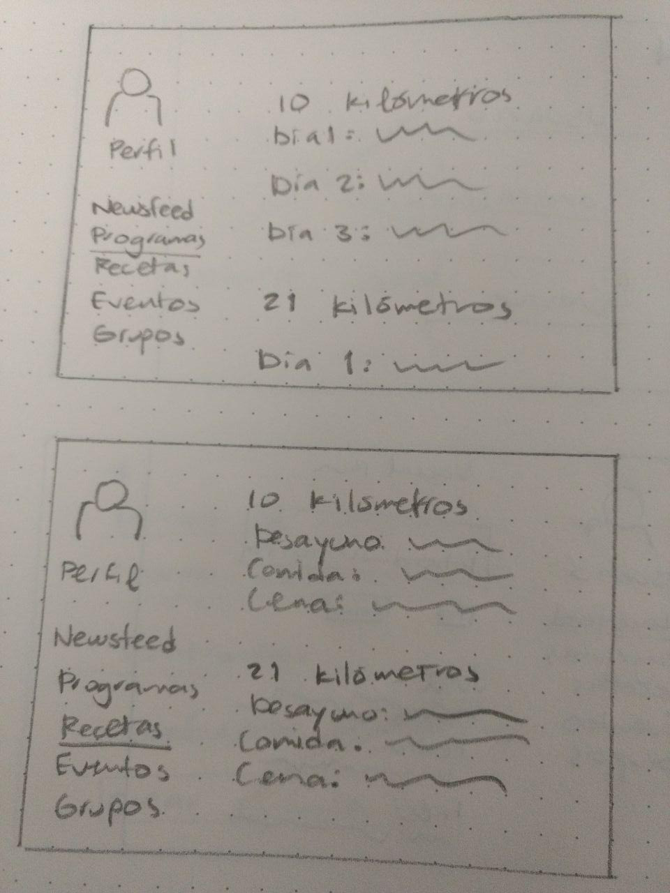

https://biokah.github.io/social-network/

### SOBRE EL PRODUCTO
El objetivo de este proyecto es crear una red social que cumpla los siguientes requisitos:
- Perfiles de usuarios
- Un newsfeed donde puedes ver las actualizaciones de todos tus contactos
- Un lugar donde poder escribir posts
- Un lugar para subir fotos
- Capacidad para poder tener amigos o para poder seguir a personas/marcas dentro de la red social
- Ser mobile friendly

### Integrantes del Equipo:
- Marisol Juárez Calderón
- María Anaís Reyes Casanova

### Descripción del proyecto

Después de un proceso de planeación, decidimos crear una plataforma para corredores en México llamada Social Run.
La temática de la red social fue elegida debido a los beneficios que aporta una actividad física de mediana/alta intensidad, y es accesible, pues no requiere una suscripción o mensualidad a un centro deportivo. No obstante, es necesario contar con la información adecuada, tanto en términos del equipo necesario así como en aspectos básicos de nutrición y planes adecuados según el objetivo planteado (mejorar en resistencia, velocidad, etc.)

 El objetivo es que la red social ofrezca recursos necesarios para formar un plan de entrenamiento (rutinas, programas, recetas), fortalezca las comunidades de corredores según localidad y permita a los usuarios organizarse en sesiones de entrenamiento y asistir a eventos locales, nacionales e internacionales. Estas conclusiones están basadas en las 31 encuestas aplicadas a personas que pertenecen a comunidades de corredores en distintas ciudades del país, con los siguientes resultados:

La pregunta principal y la primera en plantearse es sobre la importancia de crear una nueva red social con contenido exculsivo. La respuesta positiva fue del 60%.

La segunda pregunta está enfocada en las principales funcionalidades y recursos de interés para el usuario de la red social.

La tercera pregunta es sobre la importancia de difusión de eventos locales con un 97% de respuesta positiva.

Los eventos internacionales también generan interés por parte de la comunidad.

Una funcionalidad de la red social sería establecer conectividad con los dispositivos tecnológicos con GPS y medidor de frecuencia cardiaca, pues estos permiten contabilizar la relación distancia / tiempo y las calorías gastadas en una sesión de entrenamiento.

Un 55% de los encuestados manifestaron interés en socializar logros mediante redes sociales.

El 65% de los encuestados utilizan app de mensajería como whatsapp y redes sociales como Facebook para socializar lo relacionado al running.

El 72% tiene interés en entrenamientos personalizados según edad, sexo, resistencia, etc.

La vinculación de corredores con marcas fue recibida con el 90% de respuesta positiva.

Finalmente, los organizadores y entrenadores también manifestaron interés en utilizar una plataforma para difundir su trabajo.

Según los resultados, el principal interés de la comunidad de corredores reside en una plataforma para difusión de eventos, para compartir  con contactos la actividad realizada, ya sea participación en eventos o un logro de resistencia/velocidad, planes detallados de entrenamiento y vías de comunicación con otros corredores. 

Actualmente existen otras páginas con contenido relacionado, que cumplen fines informativos pero carecen de las funcionalidades que ofrece una red social, por ejemplo la interacción con otros usuarios, creación de grupos, etc. 
Entre estas encontramos: 

Runmx:

Runnersmx:

En donde correr:

 

### ¿Por qué es importante que se fotalezcan las comunidades de corredores?

La socialización de objetivos representa un beneficio adicional de motivación ante un entrenamiento, crea una identidad, un sentido de pertenencia a un grupo y permite organizarse según problemáticas que existan en el mundo del runner. 
Un ejemplo de la importancia de la organización entre corredores es la situación de inseguridad que se generó en zonas de entrenamiento en el DF. Ante esto, los corredores asiduos se organizaron pare exigir mejorar las medidas de seguridad por parte del Gobierno del DF y de la Delegación Tlalpan, así como de la administración del lugar. 

Ante páginas informativas y grupos que se organizan en vías no especializadas, una red social ofrece ambos beneficios tanto para corredores con experiencia así como para quien busca iniciar con esta actividad física. 

### Sutentabilidad

Desde la perspectiva financiera, nuestra propuesta pretende tener sustentabilidad a través de una sección dedicad a la publicidad y a la colaboración con marcas enfocadas al bienestar y acondicionamiento físico. Estas marcas organizan eventos y una colaboración con la red social le ofrecería beneficios a los usuarios en dichos eventos, como descuentos, mercancía a menor precio, etc. 

### SKETCH 

### Herramientas:
- HMTL y CSS para estructurar y diseñar el aspecto visual del sitio web
- Funciones y herramientas JavaScript como parte del desarrollo Front-end
- Librería JQuery
- Framework Materialize como herramienta visual y facilitador para logar un diseño responsivo que pueda utilizarse en cualquier dispositivo. 

